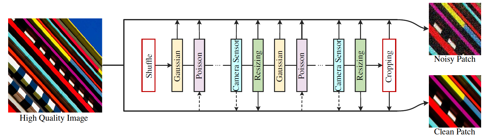
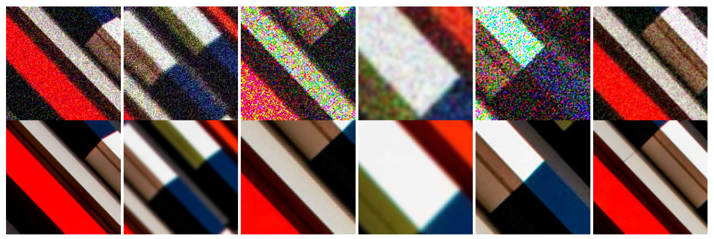
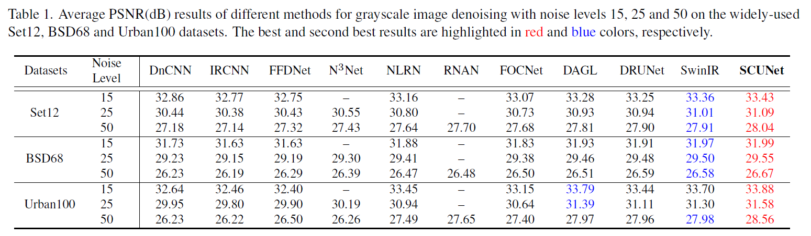
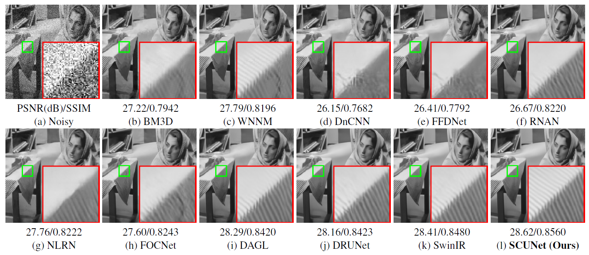
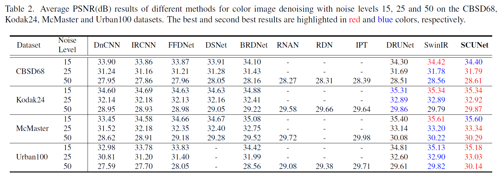
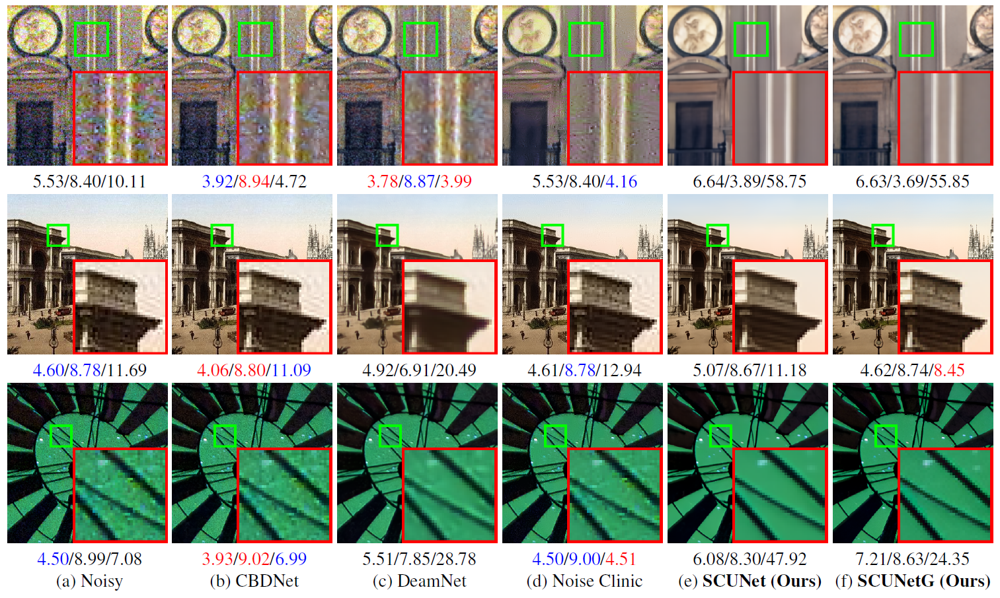
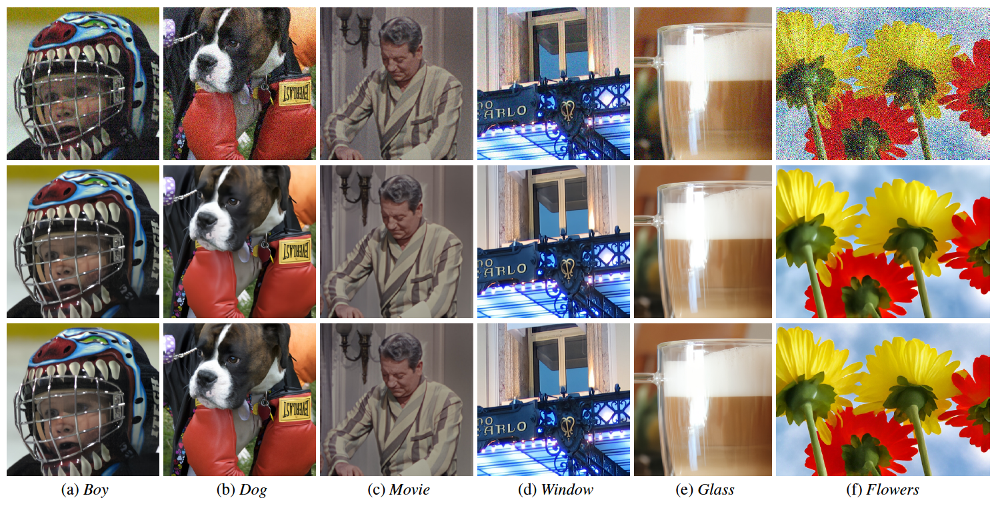

# _Practical Blind Image Denoising via Swin-Conv-UNet and Data Synthesis_

## 🔬 CoMPAS Lab @ MBARI Fork

This is a fork of the original SCUNet repository, enhanced and maintained by the **CoMPAS Lab** at the **Monterey Bay Aquarium Research Institute (MBARI)**.

### 🚀 Improvements in this Fork

- **Memory-Efficient Processing**: Enhanced [`main_infer_scunet.py`](main_infer_scunet.py) with optimized tile-based processing for large images
- **GPU Memory Management**: Automatic memory cleanup and garbage collection to handle large datasets
- **Half-Precision Support**: Optional FP16 processing to reduce GPU memory usage by ~50%
- **CPU Fallback Mode**: Full CPU processing support for systems without sufficient GPU memory
- **Tiled Processing**: Intelligent tile-based inference with configurable overlap for seamless large image processing

---


**Original Repository**:
[cszn/SCUNet](https://github.com/cszn/SCUNet)
[[ArXiv Paper](https://arxiv.org/pdf/2203.13278.pdf)]
[[Online Demo]](https://replicate.com/cszn/scunet)
[[Published Paper](https://link.springer.com/article/10.1007/s11633-023-1466-0)]

The following results are obtained by our SCUNet with purely synthetic training data!
We did not use the paired noisy/clean data by DND and SIDD during training!

<p align="left">
  <a href="https://github.com/cszn/SCUNet">
    
    
    
    
  </a>
</p>

<p align="left">
  <a href="https://github.com/cszn/SCUNet">
    
    
    
    
  </a>
</p>

## Swin-Conv-UNet (SCUNet) denoising network


The architecture of the proposed Swin-Conv-UNet (SCUNet) denoising network. SCUNet exploits the swin-conv (SC) block as
the main building block of a UNet backbone. In each SC block, the input is first passed through a 1×1 convolution, and subsequently is
split evenly into two feature map groups, each of which is then fed into a swin transformer (SwinT) block and residual 3×3 convolutional
(RConv) block, respectively; after that, the outputs of SwinT block and RConv block are concatenated and then passed through a 1×1
convolution to produce the residual of the input. "SConv" and "TConv" denote 2×2 strided convolution with stride 2 and 2×2 transposed
convolution with stride 2, respectively.

## New data synthesis pipeline for real image denoising



Schematic illustration of the proposed paired training patches synthesis pipeline. For a high quality image, a randomly shuffled
degradation sequence is performed to produce a noisy image. Meanwhile, the resizing and reverse-forward tone mapping are performed
to produce a corresponding clean image. A paired noisy/clean training patches are then cropped for training deep blind denoising model.
Note that, since Poisson noise is signal-dependent, the dashed arrow for "Poisson" means the clean image is used to generate the Poisson
noise. To tackle with the color shift issue, the dashed arrow for "Camera Sensor" means the reverse-forward tone mapping is performed on
the clean image.



Synthesized noisy/clean patch pairs via our proposed training data synthesis pipeline. The size of the high quality image patch is
544×544. The size of the noisy/clean patches is 128×128.

## Web Demo

Try Replicate web demo for SCUNet models here [](https://replicate.com/cszn/scunet)

## Usage

### 1. Download SCUNet models

```bash
python main_download_pretrained_models.py --models "SCUNet" --model_dir "model_zoo"
```

### 2. Enhanced Memory-Efficient Inference (CoMPAS Enhancement)

Process images with optimized memory usage using our enhanced inference script:

```bash
# Basic usage
python main_infer_scunet.py --model_name scunet_color_real_psnr --input_dir testsets --output_dir results

# Memory-efficient processing with half precision
python main_infer_scunet.py --model_name scunet_color_real_psnr --input_dir testsets --output_dir results --half_precision

# CPU-only processing (no GPU required)
python main_infer_scunet.py --model_name scunet_color_real_psnr --input_dir testsets --output_dir results --cpu_mode

# Custom tile size for large images
python main_infer_scunet.py --model_name scunet_color_real_psnr --input_dir testsets --output_dir results --tile_size 512
```

**New Features in Enhanced Inference:**

- Automatic memory management and cleanup
- Configurable tile processing for large images
- Half-precision (FP16) support for 50% memory reduction
- CPU fallback mode for systems with limited GPU memory
- Real-time GPU memory monitoring

### 3. Traditional Gaussian denoising

1. **Grayscale images**

   ```bash
   python main_test_scunet_gray_gaussian.py --model_name scunet_gray_25 --noise_level_img 25 --testset_name set12
   ```

2. **Color images**

   ```bash
   python main_test_scunet_color_gaussian.py --model_name scunet_color_25 --noise_level_img 25 --testset_name bsd68
   ```

### 4. Blind real image denoising

```bash
python main_test_scunet_real_application.py --model_name scunet_color_real_psnr --testset_name real3
```

```bash
python main_test_scunet_real_application.py --model_name scunet_color_real_gan --testset_name real3
```

## Results on Gaussian denoising







## Results on real image denoising





## License

This project is licensed under the Apache License 2.0. See [LICENSE](LICENSE) for details.

### Attribution

Original work: Copyright (c) 2022 Kai Zhang (cskaizhang@gmail.com, https://cszn.github.io/)
Modifications: Copyright (c) 2025 Monterey Bay Aquarium Research Institute (MBARI)

Significant modifications and additional features have been made by the CoMPAS Lab at MBARI to enhance memory efficiency and processing capabilities for marine research applications.

## Citation

```bibtex
@article{zhang2023practical,
   author = {Zhang, Kai and Li, Yawei and Liang, Jingyun and Cao, Jiezhang and Zhang, Yulun and Tang, Hao and Fan, Deng-Ping and Timofte, Radu and Gool, Luc Van},
   title = {Practical Blind Image Denoising via Swin-Conv-UNet and Data Synthesis},
   journal = {Machine Intelligence Research},
   DOI = {10.1007/s11633-023-1466-0},
   url = {https://doi.org/10.1007/s11633-023-1466-0},
   volume={20},
   number={6},
   pages={822--836},
   year={2023},
   publisher={Springer}
}
```

---

**CoMPAS Lab @ MBARI**
